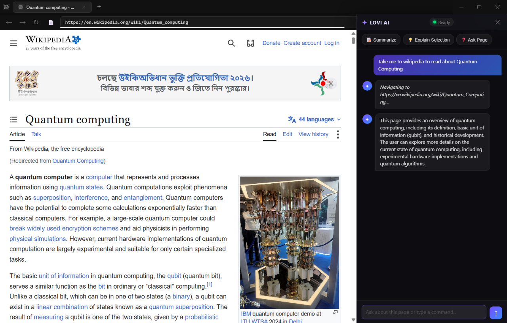
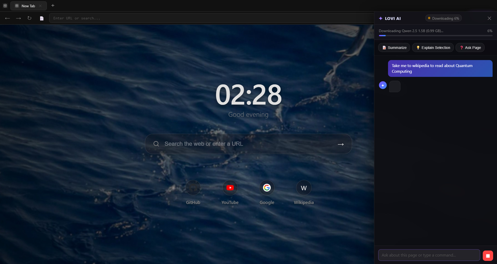
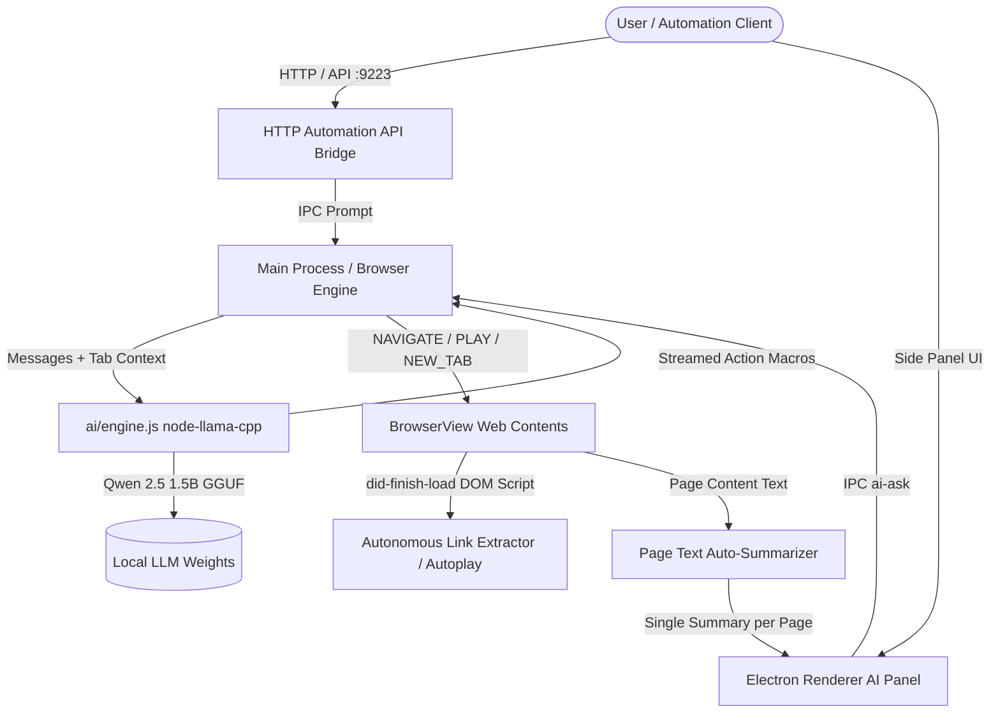

# 🤖 LOVI AI Browser

> **Autonomous, Privacy-First AI Companion Browser** powered by local LLMs (Qwen 2.5 1.5B), Chrome DevTools Protocol (CDP), and a real-time HTTP Automation API.

[](https://opensource.org/licenses/MIT)
[](https://www.electronjs.org/)
[](https://nodejs.org/)
[](https://huggingface.co/Qwen/Qwen2.5-1.5B-Instruct-GGUF)
[](#-privacy--local-ai)

---

## 📸 Screenshots

| 🤖 Autonomous Web Navigation & Live AI Conversation | 🏠 New Tab & AI Side Panel |
| :---: | :---: |
|  |  |

---

## 🌟 Overview

**LOVI** is an autonomous AI browser assistant built on Electron that operates **100% locally** on your machine. Powered by `node-llama-cpp` and the quantized **Qwen 2.5 1.5B Instruct** model, LOVI acts as an intelligent companion that can converse naturally, navigate the web autonomously, search dynamically via DuckDuckGo, auto-summarize web pages, queue YouTube music playlists, and expose real-time automation hooks over HTTP and Chrome DevTools Protocol.

No cloud API keys, no subscription fees, no data leaving your device.

---

## ✨ Key Features

### 🧠 100% Local AI Intelligence
- Powered by `node-llama-cpp` executing CPU/GPU inference via GGUF quantization.
- Zero API keys, zero cloud latency dependencies, completely private.

### 🌐 Autonomous Dynamic Web Routing
- Dynamic search fallback powered by DuckDuckGo HTML routing (`getDynamicSearchUrl`).
- Autonomous organic link extractor that scans search results and automatically jumps directly to top organic results.

### 🎬 YouTube Autoplay & Music Queueing
- Emits action macros (`[PLAY]`, `[QUEUE]`) to automatically search YouTube, click non-Shorts videos, and initiate autoplay or continuous playlist mixing.

### 🔌 Real-Time HTTP Automation API (`:9223`)
- Built-in lightweight REST automation server enabling external agent control, state inspection, prompt injection, and live screenshot generation.

### 📡 Chrome DevTools Protocol (`:9222`)
- Native `--remote-debugging-port=9222` integration for inspection and external CDP automation frameworks.

### 📰 Single-Trigger Auto-Summarization
- Automatically reads and summarizes active web page content once per URL navigation, maintaining context without spamming multi-turn conversations.

### 🗂️ Multi-Tab Contextual Awareness
- Feeds live tab titles, IDs, and active URLs into the LLM system prompt context for natural tab management (`[NEW_TAB]`, `[CLOSE_TAB]`, `[SWITCH_TAB]`).

---

## 🏗️ Architecture



---

## 🚀 Quick Start

### Prerequisites
- **Node.js** >= 18.0.0
- **npm** >= 9.0.0
- C++ compilation toolchain (for native `node-llama-cpp` bindings if rebuilding)

### Installation

```bash
# Clone the repository
git clone https://github.com/shubh2moon-hub/lovi-ai-browser.git
cd lovi-ai-browser

# Install dependencies
npm install
```

### Running LOVI

```bash
npm start
```

*Note: On first run, LOVI will automatically download the quantized Qwen 2.5 1.5B model (~0.99 GB) into the `models/` directory.*

---

## 🔌 HTTP Automation API Reference (`http://127.0.0.1:9223`)

LOVI exposes a REST API for automated end-to-end testing, headful inspection, and external agent orchestration.

| Endpoint | Method | Description | Payload / Response |
| :--- | :--- | :--- | :--- |
| `/api/state` | `GET` | Get current browser state, open tabs, active tab ID, and last AI output. | `{ success: true, tabs: [...], activeTabId: "...", lastAiOutput: "..." }` |
| `/api/prompt` | `POST` | Inject a prompt into the LOVI AI panel. | `{ prompt: "Take me to wikipedia to read about Quantum Computing" }` |
| `/api/navigate` | `POST` | Directly navigate the active tab or create a new tab. | `{ url: "https://wikipedia.org", newTab: true }` |
| `/api/screenshot` | `GET` | Capture a full window PNG screenshot. | Returns `image/png` binary data. |

### Example E2E Automation Script

```javascript
const response = await fetch('http://127.0.0.1:9223/api/prompt', {
    method: 'POST',
    headers: { 'Content-Type': 'application/json' },
    body: JSON.stringify({ prompt: "Take me to wikipedia to read about Quantum Computing" })
});
const result = await response.json();
console.log(result);
```

Or run the built-in verification suite:

```bash
npm run test:e2e
```

---

## 🛠️ Project Structure

```
lovi-ai-browser/
├── ai/
│   ├── engine.js          # node-llama-cpp engine wrapper & streaming controller
│   └── tasks.js           # Prompt templates, system instructions & skill definitions
├── renderer/
│   ├── index.html         # Main browser frame & AI side panel DOM
│   ├── renderer-ai.js     # Side panel UI controller & IPC bridge
│   └── style.css          # Glassmorphism aesthetic & UI styling
├── main.js                # Core Electron process, BrowserView manager & IPC router
├── preload.js             # Electron preload context isolation bridge
├── view-preload.js        # Webview DOM extraction preload script
├── start.js               # Application launcher
├── test-api-e2e.js        # E2E HTTP API verification harness
├── test-client.html       # Visual automation test client
└── package.json           # Dependencies & build scripts
```

---

## 🤝 Contributing

Contributions, issues, and feature requests are welcome! Feel free to check the [issues page](https://github.com/shubh2moon-hub/lovi-ai-browser/issues).

1. Fork the Project
2. Create your Feature Branch (`git checkout -b feature/AmazingFeature`)
3. Commit your Changes (`git commit -m 'Add some AmazingFeature'`)
4. Push to the Branch (`git push origin feature/AmazingFeature`)
5. Open a Pull Request

---

## 📄 License

Distributed under the MIT License. See `LICENSE` for more information.
